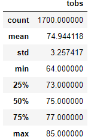
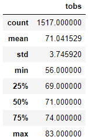

# surfs_up
The goal of this analysis is to use sqlite, sqlalchemy, and python to analyze weather data from various Hawaiian stations over several years.

## Project Overview
Using the tools mentioned above, temperature data from June and December was summarized from the various weather stations. 

## Results

June Statistics

December Statistics

There are a few things that can be determined from the data:

- On average, Hawaiian temperatures are higher in June, than in December
- Though temperatures are lower in December, the December high temp is almost as high as the June high
- Understandably given the other two points, December temperatures have a wider range and are more erratic, with a larger standard deviation. That is to say, temperature is more predictable on any given day in June.

## Summary
Generally speaking, temperatures in June are warmer than in December, making them more conducive to surfing and selling ice cream. With the data provided, preicipitation data can also be analyzed by using, for example: 

june_rain = session.query(Measurement.prcp).filter(extract('month', Measurement.date) == 6).all() 

Though wind speed would also probably give insight into the popularity of surfing and ice cream sales, that data is not included in the sqlite file provided. Temperatures could be plotted on a line graph, both to see seasonality visually, and possibly to see any overall trends with temperatures year over year.

